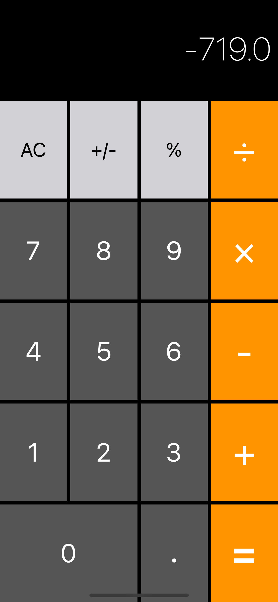
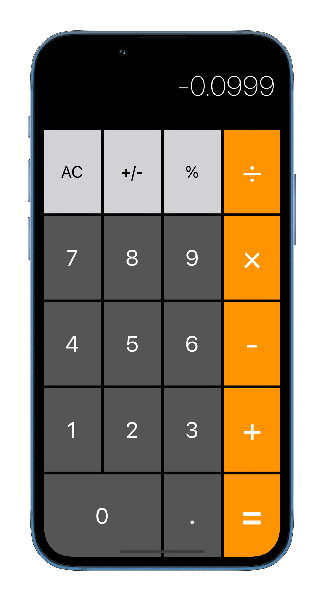

# Calculator

When developing the calculator, topics such as:
- Swift Access Levels
- Optionals
- Computed Properties
- Structs vs. Classes
- Swift Tuples
- Guard Let vs. If Let When to Use Which?

---

<table>
  <tr>
    <td></td>
    <td></td>
  </tr>
 </table>
